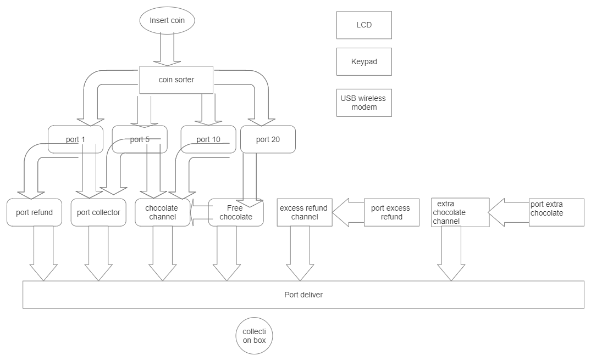

# Requirements
Repository to do an internship project on embedded systems
## High Level Requirements
|ID|Descrption|Status|
|--|----------|------|
|HR01|User can have chocolates as he wish|Present|
|HR01|User can have return change when price is below inserted coin|Present|
|HR03|User can have refundable amount when chocolates are finished |Present|
|HR02|User can have extra chocolate when there is an offer|Present|
|HR03|We can insert cash[notes]|Not Present|

## Low Level Requirements
|ID|Description|Status|
|--|-----------|------|
|LR01|User can insert 1rs,5rs,10rs,20rs coins respectively|Present|
|LR02|Status for displaying(LCD)message|Present|
|LR03|Bowl for collecting chocolates|Present|
|LR04|Automatic change in price of chocolate increases|Not Present|
# Block Diagram

It is similar to ACVM structure but made some changes by adding extra ports and some mechanical changes.
# Application
First a user inserts a coin for buying a chocolate like 1rs,5rs,10rs,20rs coins for corresponding chocolates.Each port in the block diagram directed to value of the coin with help of coin sorter.When the port recives a coin it generates an interrupt where it helps to send signal to corresponding read ports for reading the value of coin and there are also LCD,Keypad for message viewing and status of the machine.And there is a option for refund in any case there is a problem with the machine or completion of product and also there is an option for change we get if the cost is less than what we inserted.Here i also added buy 2 get 1 with help of another extra port for extra chocolate and at last he can collect the chocolate in port deliver which is collection box.But here problem is when the cost of the chocolate changes we have to reset the code.This is the application of "Automatic Chocolate Vending Machine".
# Components
LCD-It displays the message and status of the machine
Port Deliver-It is a bowl where the user collects the chocolates
Ports 1,5,10,20-For inserting coresponding coins
Hardware components-micro controller 8051(for RAM nd ROM),RTOS code for scheduling tasks,coin sorter,chocolate channel,coin channel,USB Modem,LCD,Powersupply
