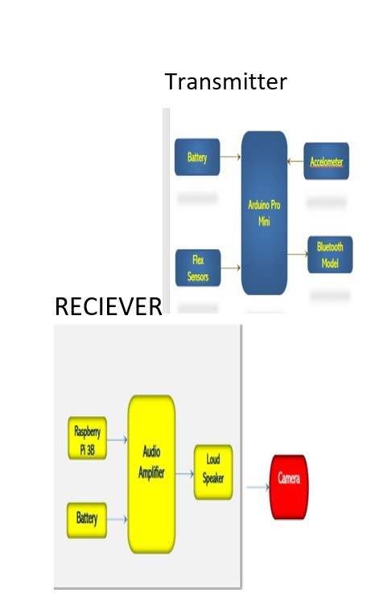

# Second case study
Here it is an simple embedded project which i done in my Btech 4th year.It is known as" Designing the speech conversion for dumb".Where the dumb and deaf can communicate with normal individuals using hand gestures.This is the block diagram where it has transmitter and reciever part. 

